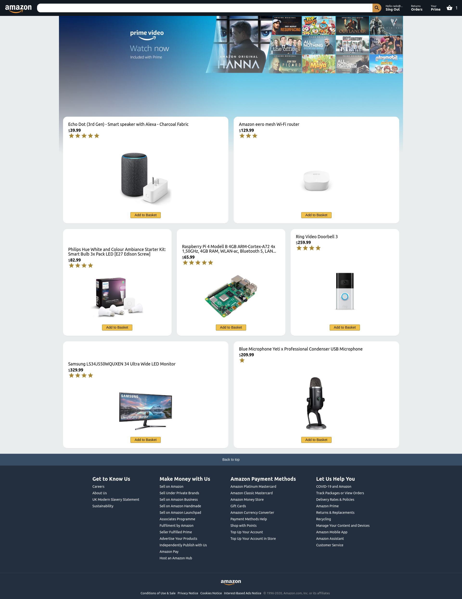

# Amazon Clone

This is a code along and extended by myself tutorial following the 5 day react course hosted on Facebook by 'Clever Programmer'.

The aim is to build a serverless replica of the Amazon website using React, Stripe and Firebase.

## Built With

- Firebase
  - Functions
- React
  - Hooks
  - Context API
  - Axios
  - Router

## Functionality

- Stripe payments
- Users
- Shopping cart
- Checkout
- Orders history

## Live Demo

[Live Demo Link](https://clone-aa0a9.web.app/)

## Installation and Setup Instructions

#### Example:

Clone down this repository. You will need `node` and `npm` installed globally on your machine.

Installation:

`npm install`

To Start Server:

`npm start`

To Visit App:

`localhost:3000`
